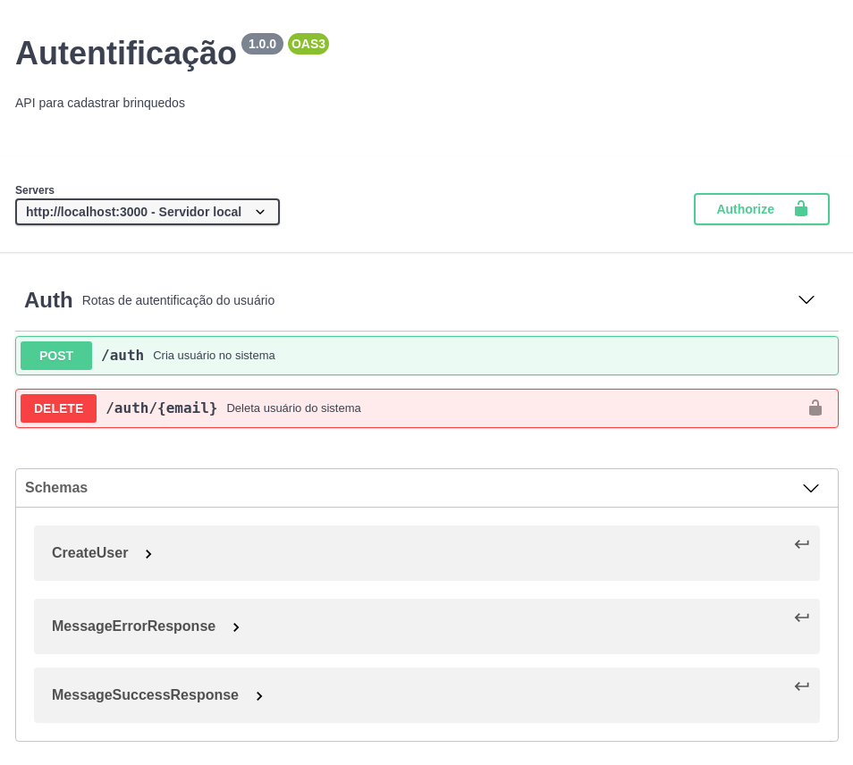

# Uma simples documentação de API usando a Especificação OpenAPI

Neste artigo irei explicar como documentar sua API com OpenAPI na versão 3.0.1.

Para comerçarmos, vou explicar primeiro o que seria essa documentação, para isso vou deixar a definição do [site oficial](https://swagger.io/specification/) dessa especificação:

> A especificação OpenAPI (OAS) define uma interface padrão independente de linguagem para APIs RESTful que permite que humanos e computadores descubram e entendam os recursos do serviço sem acesso ao código-fonte, documentação ou por meio de inspeção de tráfego de rede. Quando definido corretamente, um consumidor pode entender e interagir com o serviço remoto com uma quantidade mínima de lógica de implementação.

Ou seja, nada mais é do que uma interface, em quem ver ela, conseguirá entender o que a API faz. Para entendermos melhor, vamo começar a escrever nossa documentação, para isso vamos imaginar uma api básica de autentificação , em que teria as seguintes rotas:

**Rotas**:

- Auths:
  - POST - Cria usuário
  - 🔒 DELETE - Deleta Usuario

## Primeiro passo

A primeira coisa que temos que fazer é escolher um editor para escrevermos nossa documentação, para isso recomendo o [Swagger Editor](https://editor.swagger.io/), nele temos verificação de sintaxe, preview de como ta ficando a documentação e além disso tem como exportar em vários formatos essa documentação. _Lembrando que se você exportar em .yaml, o GitLab mostra a interface gráfica da documentação_

Entrando nesse editor vocês verão um documento já escrito anteriormente como exemplo, porém como iremos criar um do zero, você pode apagar tudo que está nesse documento, para isso, no canto superior esquerdo clique em _File > Clear editor_.

## Escrevendo a documentação

Agora, podemos começar a escrever a nossa documentação:

Na primeira linha do editor, você irá escrever a **versão da especificação**, neste caso iremos usar a openapi 3.0.1:

```yaml
1  | openapi: 3.0.1
```

Na próxima linha, vem as informações da sua API como o título, descrição e versão dela:

```yaml
2  | info:
3  |   title: Autentificação
4  |   description: API para autentificação de usuários
5  |   version: 1.0.0
```

Logo após as informações, coloca os servidores que rodam aquela aplicação, no caso da nossa seria somente o servidor local:

```yaml
6  | servers:
7  |   - url: http://localhost:3000
8  |     description: Servidor local
```

Agora o próximo passo é definir as tags, para que assim podermos separar as nossas rotas de acordo com sua categoria. Ex.: _Auth_

```yaml
9  | tags:
10 |  - name: Auth
11 |    description: Rotas de autentificação do usuário
```

Com o nosso _"header"_ da documentação definido, podemos começar a escrever as nosssas rotas, para isso definimos os paths delas:

```yaml
12 | paths:
```

As rotas de autenticação tem o path base: /auth

```yaml
13 |   /auth:
```

Após definido nosso path, começamos a escrever as rotas daquele path, sendo a primeira que iremos escrever a de criar usuários, então a primeira coisa a se escrever, é o metodo http, seguido das tags, resumo, descrição e id

```yaml
14 |     post:
15 |       tags:
16 |         - Auth
17 |       summary: Cria usuário no sistema
18 |       description: Cria usuário no sistema
19 |       operationId: CreateUser
```

Logo após, podemos começar a definir os parâmetros da rota, que nesse caso será o `email`, `password` e o `name` do usuário no body, pra isso criaremos um schema, e aproveitando criaremos o squema de segurança, os dois são definidos dentro de `components`, nas ultimas linhas.

```yaml
114| components:
115|   schemas:
116|     CreateUser:
117|       type: object
118|       properties:
119|         email:
120|           type: string
121|         password:
122|           type: string
123|         name:
124|           type: string
---
137|   securitySchemes:
138|     Bearer:
139|       type: apiKey
140|       name: Authorization
141|       in: header
```

Após criado os componentes, podemos voltar para a rota, onde o próximo atributo será o body a requisição:

```yaml
20 |       requestBody:
21 |         content:
22 |           application/json:
23 |             schema:
24 |               $ref: '#/components/schemas/CreateUser'
25 |         required: true
```

Repare que usamos como referência o nosso esquema usado anteriormente. Após isso definimos as respostas da nossa api, para isso vamos criar um esquema de resposta padrão.

```yaml
125|     MessageErrorResponse:
126|       type: object
127|       properties:
128|         message:
129|           type: string
130|           default: Mensagem de erro
```

Após isso podemos escrever nossas respostas, elas são escritas da seguinte forma

```
responses
  {{CÓDIGO}}:
    description: {{descrição}}
    content: {{resposta}}
```

Na nossa documentação ficaria assim

```yaml
26 |      responses:
27 |        201:
28 |          description: CREATED
29 |          content:
30 |            application/json:
31 |              schema:
32 |                type: object
33 |                properties:
34 |                  token:
35 |                    type: string
36 |        400:
37 |          description: BAD REQUEST
38 |          content:
39 |            application/json:
40 |              schema:
41 |                $ref: '#/components/schemas/MessageErrorResponse'
42 |        401:
43 |          description: UNAUTHORIZED
44 |          content:
45 |            application/json:
46 |              schema:
47 |                $ref: '#/components/schemas/MessageErrorResponse'
48 |        404:
49 |          description: NOT FOUND
50 |          content:
51 |            application/json:
52 |              schema:
53 |                $ref: '#/components/schemas/MessageErrorResponse'
54 |        409:
55 |          description: CONFLICTED
56 |          content:
57 |            application/json:
58 |              schema:
59 |                $ref: '#/components/schemas/MessageErrorResponse'
60 |        500:
61 |          description: SERVER INTERNAL ERROR
62 |          content:
63 |            application/json:
64 |              schema:
65 |                $ref: '#/components/schemas/MessageErrorResponse'
```

Logo após isso colocamos como chama o corpo nossa requisição:

```yaml
66 |       x-codegen-request-body-name: body
```

Agora vamos construir nossa rota para deletar usuários, o path dele é /auth/:email, para isso vamos criar um novo path na documentação, e usando o email como parâmetro no path a partir de {}

```yaml
67 |   /auth/{email}:
```

Na sequencia vamos fazer os mesmos passos do endpoint anterior

```yaml
68 |     delete:
69 |       tags:
70 |         - Auth
71 |       summary: Deleta usuário do sistema
72 |       description: Deleta usuário do sistema
73 |       operationId: DeleteUser
```

Porém nesse endpoint o nosso parâmetro é no path, assim representamos da seguinte forma:

```yaml
74 |       parameters:
75 |         - name: email
76 |           in: path
77 |           required: true
78 |           schema:
79 |             type: string
```

Agora é a hora de definirmos as reposta, já que o delete possui uma resposta de sucesso padrão da api, podemos criar um schema com isso:

```yaml
131|     MessageSuccessResponse:
132|       type: object
133|       properties:
134|         message:
135|           type: string
136|           default: Mensagem de sucesso
```

E agora escrevermos as respostas da API

```yaml
80 |       responses:
81 |         200:
82 |           description: OK
83 |           content:
84 |             application/json:
85 |               schema:
86 |                 $ref: '#/components/schemas/MessageSuccessResponse'
87 |         400:
88 |           description: BAD REQUEST
89 |           content:
90 |             application/json:
91 |               schema:
92 |                 $ref: '#/components/schemas/MessageErrorResponse'
93 |         401:
94 |           description: UNAUTHORIZED
95 |           content:
96 |             application/json:
97 |               schema:
98 |                 $ref: '#/components/schemas/MessageErrorResponse'
99 |         404:
100|           description: NOT FOUND
101|           content:
102|             application/json:
103|               schema:
104|                 $ref: '#/components/schemas/MessageErrorResponse'
105|         500:
106|           description: SERVER INTERNAL ERROR
107|           content:
108|             application/json:
109|               schema:
110|                 $ref: '#/components/schemas/MessageErrorResponse'
```

Logo após as resposta colocamos a nossa segurança do endpoint

```yaml
111|       security:
112|         - Bearer: []
```

E pronto está feita nossa api! Ela deve se apresentar dessa forma graficamente:



E o código assim:

```yaml
openapi: 3.0.1
info:
  title: Autentificação
  description: API para cadastrar brinquedos
  version: 1.0.0
servers:
  - url: http://localhost:3000
    description: Servidor local
tags:
  - name: Auth
    description: Rotas de autentificação do usuário
paths:
  /auth:
    post:
      tags:
        - Auth
      summary: Cria usuário no sistema
      description: Cria usuário no sistema
      operationId: CreateUser
      requestBody:
        content:
          application/json:
            schema:
              $ref: '#/components/schemas/CreateUser'
        required: true
      responses:
        201:
          description: CREATED
          content:
            application/json:
              schema:
                type: object
                properties:
                  token:
                    type: string
        400:
          description: BAD REQUEST
          content:
            application/json:
              schema:
                $ref: '#/components/schemas/MessageErrorResponse'
        401:
          description: UNAUTHORIZED
          content:
            application/json:
              schema:
                $ref: '#/components/schemas/MessageErrorResponse'
        404:
          description: NOT FOUND
          content:
            application/json:
              schema:
                $ref: '#/components/schemas/MessageErrorResponse'
        409:
          description: CONFLICTED
          content:
            application/json:
              schema:
                $ref: '#/components/schemas/MessageErrorResponse'
        500:
          description: SERVER INTERNAL ERROR
          content:
            application/json:
              schema:
                $ref: '#/components/schemas/MessageErrorResponse'
      x-codegen-request-body-name: body
  /auth/{email}:
    delete:
      tags:
        - Auth
      summary: Deleta usuário do sistema
      description: Deleta usuário do sistema
      operationId: DeleteUser
      parameters:
        - name: email
          in: path
          required: true
          schema:
            type: string
      responses:
        200:
          description: OK
          content:
            application/json:
              schema:
                $ref: '#/components/schemas/MessageSuccessResponse'
        400:
          description: BAD REQUEST
          content:
            application/json:
              schema:
                $ref: '#/components/schemas/MessageErrorResponse'
        401:
          description: UNAUTHORIZED
          content:
            application/json:
              schema:
                $ref: '#/components/schemas/MessageErrorResponse'
        404:
          description: NOT FOUND
          content:
            application/json:
              schema:
                $ref: '#/components/schemas/MessageErrorResponse'
        500:
          description: SERVER INTERNAL ERROR
          content:
            application/json:
              schema:
                $ref: '#/components/schemas/MessageErrorResponse'
      security:
        - Bearer: []

components:
  schemas:
    CreateUser:
      type: object
      properties:
        email:
          type: string
        password:
          type: string
        name:
          type: string
    MessageErrorResponse:
      type: object
      properties:
        message:
          type: string
          default: Mensagem de erro
    MessageSuccessResponse:
      type: object
      properties:
        message:
          type: string
          default: Mensagem de sucesso
  securitySchemes:
    Bearer:
      type: apiKey
      name: Authorization
      in: header
```
